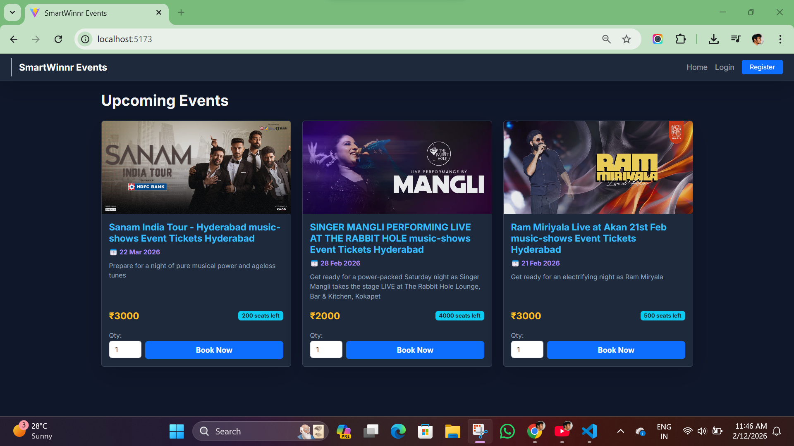
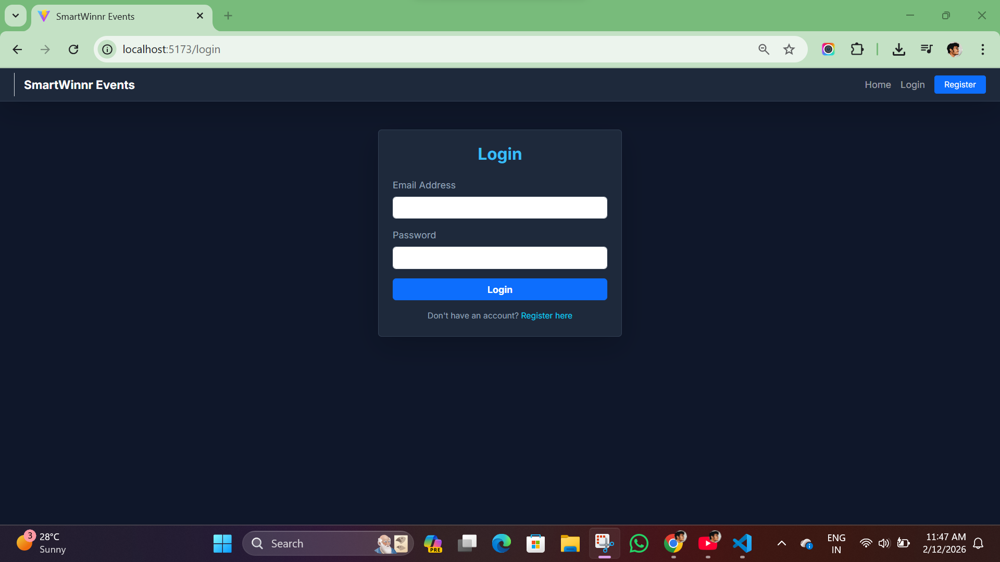
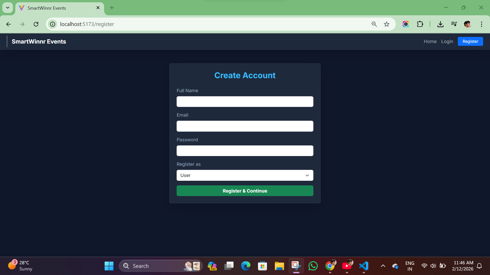
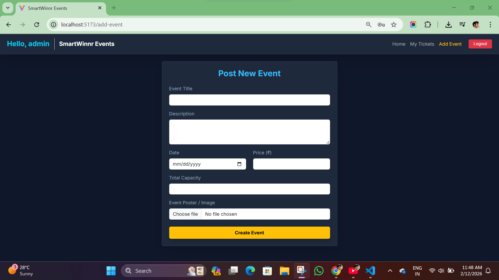
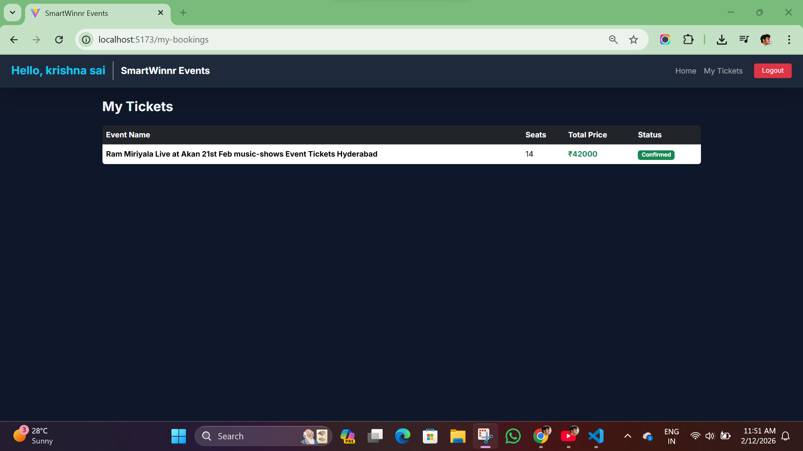
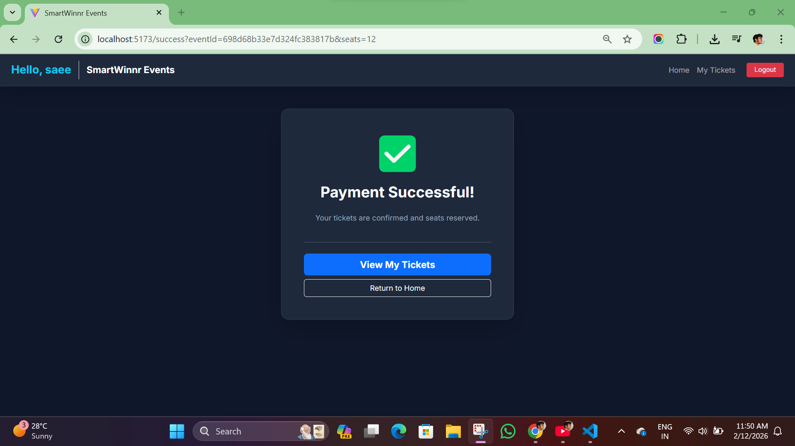

```text
                            SMARTWINNR Event Booking System
                                    TECH: MERN STACK
Frontend: React.js (Vite)
Backend: Node.js, Express.js
Database: MongoDB
CSS: Bootstrap & Custom CSS
Integrations: Stripe for Payments, Cloudinary for Image Hosting

                    To setup the project in the local with version
1. Backend Setup
cd server 
npm i
            create .env and add below api keys etc:
PORT=5000
MONGO_URL=yours
JWT_SECRET=yours
STRIPE_SECRET_KEY=yours
CLOUDINARY_NAME=yours
CLOUDINARY_KEY=yours
CLOUDINARY_SECRET=yours

            start server
nodemon server.js

2.Frontend Setup
cd client
npm i
npm run dev


                            KEY FEATURES
1.Automatically updates seat counts after booking.
2.Stripe integration for ticket purchases.(Used test keys jst for displaying)
3.Able to upload event posters via Cloudinary.
4.Session persistence with JWT.


### SCREENSHOTS

#### Home Page


#### Login & Register



#### Event Management


#### Booking History


#### Payment & Success


